go!

产品全景

当前产品

备选设计

IP 角色

缺省状态

历史图册

FULL READING / NO INTERACTION REQUIRED

# go! 完整产品阅读

整理于 2026-10-05。全部内容直接展开，无需点击控件或执行脚本。顶部导航仅在本页定位，不打开二级页面；也可以直接向下滚动阅读全部内容。。

  

当前实现 · 0.1.18

## 产品全景

先看入口，再看去向。这里画的是 App 的页面关系；网站仍是一页到底。

  

    

一级入口 · 底部 Tab

### Todo

快速记录 · 事情清单

↓ 从首页进入

事情详情 · 岛屿 · Go
成长报告与足迹

    

一级入口 · 底部 Tab

### 记

原话记录 · AI 整理

↓ 从记录中找回

历史 → 消息记录
整理结果 → 事情详情

    

共用入口 · 不是第三个 Tab

### 我的

由 Todo／记的个人入口打开

↓ 管理与设置

备份恢复 · 导出 · 归档
担忧与状态 · AI 授权

  

  
文字总览：Todo 承接事情与行动，记承接原话与整理，两者共用事情详情和个人设置；成长报告再通往足迹与记录详情。

  

完整页面

页内展开／状态

确认弹窗／系统界面

备选／未实现

  

### 页面地图 · 按入口分组

  
二级、三级表示从某个入口进入的先后，不是固定等级；同一个详情可从多处到达。下列六组全部直接展开。

  

#### 01 · 记录与事情

入口

Todo 首页

快速输入并提交，或点事情卡片

进入页面

事情详情／编辑

可继续到达 · 可能更深

Go；新建岛屿；关联的担忧与状态

快速输入、子任务、日期选择和补充说明属于页内内容。事情详情也被岛屿、历史、聊天结果及回顾页共用，不是多份事情。

#### 02 · 岛屿与关联

入口

Todo 的岛屿入口

选择岛屿

进入页面

岛屿事情列表

可继续到达 · 可能更深

事情详情；Go；编辑岛屿；新增／查看担忧与状态

新建岛屿另有编辑页面；首页新建保存后进入该岛屿。事情或补记活动中新建岛屿，是为原表单选择归属。担忧与状态可关联多件事情，并可打开关联事情。

#### 03 · Go 与体验

入口

Todo／事情详情／岛屿列表

点 Go，开始或打开已有计时

进入页面

Go

可继续到达 · 可能更深

时段详情（查看本次记录）

暂停、继续、结束、子任务操作以及结束后的体验填写，均在 Go 页面内。单点“结束”不自动完成事情；明确完成当前事情时，同一事务结束其 Go。

#### 04 · 记与历史

入口

记（底部 Tab）

点历史入口

进入页面

历史

可继续到达 · 可能更深

消息记录；事情详情（共用）

历史内的“事情／消息”、搜索与日期筛选是页内切换。点消息进入“消息记录”，展开该对话上下文并定位所选消息；点事情打开事情详情。点“新对话”才返回记并开始新的对话。当前不是按一场存档事件汇总的新版历史。

#### 05 · 报告与足迹

入口

Todo 的成长报告入口

打开报告，再选择某一天

进入页面

成长报告 → 当日足迹

可继续到达 · 可能更深

时段详情；补记活动；活动详情；事情详情

报告中的记录也能直达相应详情。足迹可继续打开时段或活动；活动详情可进入更正活动。层级取决于进入路径，并非所有详情固定是三级页面。时段更正在详情内展开；活动更正使用编辑页面。

#### 06 · 我的与设置

入口

Todo／记的个人入口

打开我的

进入页面

我的

可继续到达 · 可能更深

备份恢复；导出；查看归档；担忧与状态；AI 处理授权

这五项各有设置页面。担忧与状态／归档可继续打开担忧记录；备份导入导出会使用系统文件界面，合并恢复有确认弹窗。AI 授权、密钥配置和连接测试在授权页面内，不代表线上服务已验证可用。

  

### 这些不是新的页面

页内展开／状态

快速输入、步骤编辑、日期控件、历史分类与筛选、Go 结束体验、时段更正与版本查看。空内容、无搜索结果和失败提示也属于状态，不单算页面。

确认弹窗／系统界面

备份合并恢复的确认、系统文件选择与导出界面；发生在原流程里，不是新的产品主入口。锁屏与灵动岛属于系统表面，也不算 App 的三级页面。

  

### 关键流程 · 操作之后发生什么

  

#### 记录与整理

1

Todo 快速输入

提交后保存一件事情

2

事情卡片

点卡片进入事情详情

3

事情详情

修改名称、日期、岛屿、步骤或补充

4

保存并返回

回到清单找回同一件事情

当前 0.1.18 的保存按钮仍在表单下方；未保存退出会丢失本次文字修改。右上角保存＋退出气泡是未合并候选，不画成现状。

#### Go 与反馈

1

选一件事情

点 Go 开始本次行动

2

Go 进行中

暂停不计时；继续重新累计

3

结束 Go

保留本次实际投入，页内展开体验

4

保存体验／返回 Todo

之后从足迹找回本次记录

“结束一轮”与“完成事情”是两件事。保存体验失败时保留输入并提供重试；不能把失败画成已保存。

#### 历史查找

1

记

点历史入口

2

历史：消息／事情

选择分类、搜索或按日期筛选

3

点结果卡片

消息 → 对话上下文；事情 → 事情详情

4

返回历史

继续查找其他记录

消息记录页不是直接返回 AI 输入页。“将整场对话手动存档成事件，并汇总产出的待办”是待完善要求，不是当前历史的已实现结构。

#### 报告与足迹

1

成长报告

选区间，再打开某一天

2

当日足迹

点时段／活动；也可补记活动

3

记录详情

查看实际内容、感受及原始／更正版本

4

保存更正并回看

统计采用生效版本，原始记录保留

补记活动保存后显示活动详情；更正活动保存后返回详情。Go 时段更正在原详情内完成。返回未提交的活动／时段更正会保留草稿，草稿不计入统计。

  

备选／未实现 · 不并入现状地图

### 下一版想改变什么

未合并候选：
事情详情右上保存、退出【保存】【不存】气泡；快速输入长文字滚动。它们不属于当前已安装版本。

待完善的历史：
用户主动存档一场对话 → 形成事件 → 历史查看完整对话及产生的待办。这是目标流程，不等于现有消息列表。

3.0 概念关系：
先存下 → 整理理解 → 选择主线 → 行动与接续。出发（暂名）、消化、滋养是工作台设想；跨岛项目与每日主线仍待定义，不画成已确定的二级／三级页面。

  
依据：0.1.18（20）／4511d35 的页面与导航代码。地图不是一次新的真机或 AI 联通验收；历史 31 张设计图包含状态，不等于 31 个实际页面。

## 一个生活外脑，不只是一张待办清单。

go! 正在探索：放心存下许多事情，按自己的运转方式理解它们，每天先顾好一条主线。保留绿色、奶白、像素山野、小女孩与小猫的亲切感，但让记录、整理和开始行动更轻松。

这段描述是
产品方向
，不是说当前 App 已完成所有能力。当前实现仍主要围绕任务、岛屿筛选、Go 计时、足迹和报告。

已实现

0.1.18 · 当前主线

本地任务、Go、子任务、岛屿、足迹、区间报告、补记活动及备份恢复已有实现。不是全产品完成声明。

候选代码

两项修复，未合并安装

详情右上保存与退出【保存】【不存】气泡；快速任务长文字上下滚动。不能当作手机已有能力。

讨论方案

3.0 · 尚未实现

运转工作台、可跨岛项目、每日一条主线、可感知时间与进展。布局、层级与规则仍待选定。

01 / CAPTURE

### 记录

快速记一件事情；原话和草稿有处可放，不依赖 AI 才能保存。

02 / ORGANIZE

### 整理

现有岛屿、子任务、日期帮助找回；跨岛项目与主线仍是新版讨论。

03 / ACT

### 行动

选一件事情 Go，开始、暂停、继续或结束，记录实际投入。

04 / REFLECT

### 反馈

结束可写实际做了什么和体验；单点结束不自动完成事情。

05 / RETURN

### 回顾

足迹与报告找回发生过的记录；未来主线回顾仍未实现。

## 优化时不要丢掉的需求

### 能存很多，也能只顾眼前。

先存下，不强迫先选分类、层级或日期。

能逐层看懂长期事项与眼前一部分，小事不必创建项目。

每天一条主线可以独立存在，不要求清空全部库存。

时间、未来安排与部分推进能够被看见。

### 轻松不是稀疏，也不是没有历史。

保留像素世界与角色，提高有效信息密度，不靠难读小字。

整理的新发现不自动变成今天的义务；休息无需证明产出。

改名和归档不能抹掉过去经历，缺记录不等于没发生。

GO 管事情、进展和外部链接，不变成文章或日记正文库。

## 一、当前实现与真实页面

当前实现 · 0.1.18

### 首页 · 先看见今天

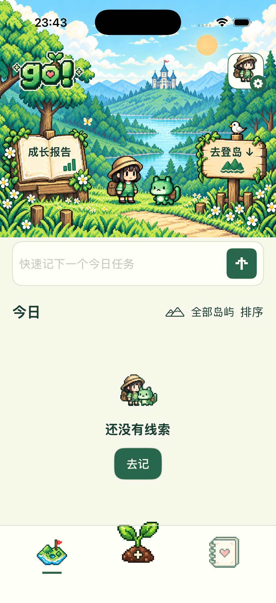

顶部绿色像素山野占据较大空间，书本是成长报告入口，木牌是岛屿入口，小女孩进入设置。下方快速输入、今日清单；底部仍是 Todo／记。

操作与结果：
打开 App → 快速记下今日任务，或进入岛屿筛选。

边界／讨论点：
首屏内容空间偏少；当前仍有 AI 入口，不代表新版导航已定。

W001 隔离模拟器真实截图；产品代码 4511d35。页面日期是测试时点，不是网站更新时间。

当前实现 · 0.1.18

### 快速记录 · 从一句话开始

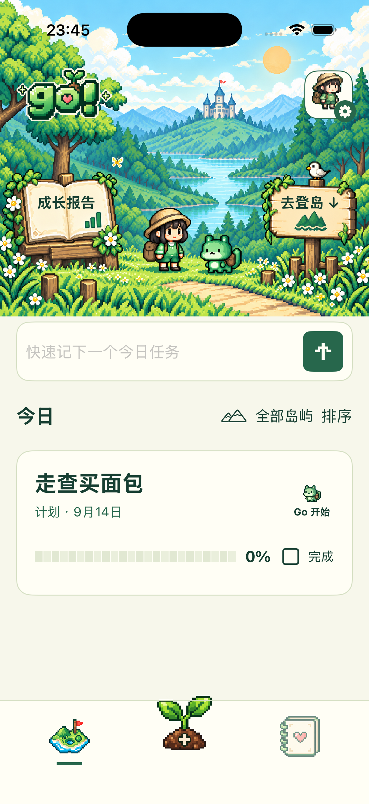

输入条下出现一张任务卡，包含名称、计划日期、Go 开始、0% 与完成框。截图中的“走查买面包”为合成测试内容。

操作与结果：
输入名称 → 提交 → 今日组找回同一条任务。

边界／讨论点：
当前快捷输入默认进入今日；3.0 希望“先存下”不自动变成今日义务，是待设计差异。

W001 隔离模拟器真实截图；产品代码 4511d35。页面日期是测试时点，不是网站更新时间。

当前实现 · 0.1.18

### Go · 把眼前这件事做一段

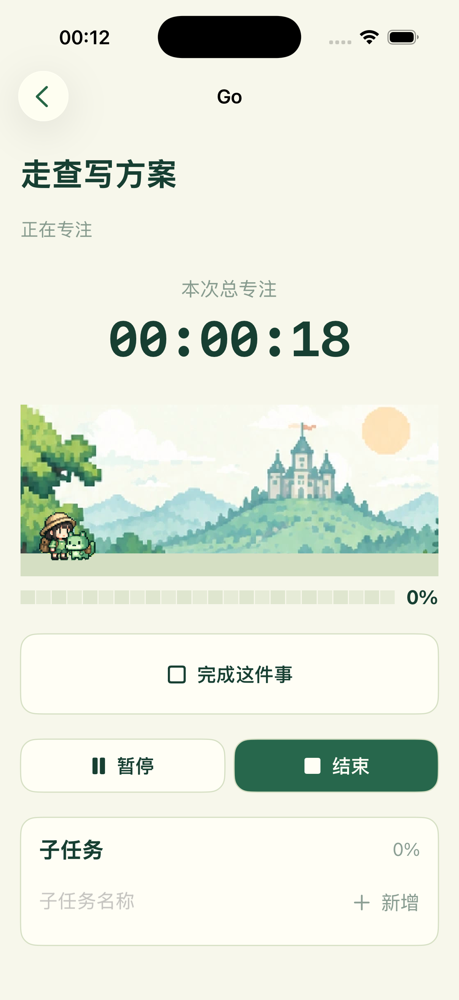

页面显示任务名称、正在专注、累计时钟、像素同行场景、进度、完成、暂停、结束与子任务。

操作与结果：
从事情进入 → 开始 → 暂停／继续 → 结束；暂停不计入实际投入。

边界／讨论点：
结束一次 Go 不等于完成整个事情；明确完成当前事情会同时结束其 Go。关闭后可恢复，未知间隔不伪造时长。

W001 隔离模拟器真实截图；产品代码 4511d35。页面日期是测试时点，不是网站更新时间。

当前实现 · 0.1.18

### 结束 · 留下本次体验

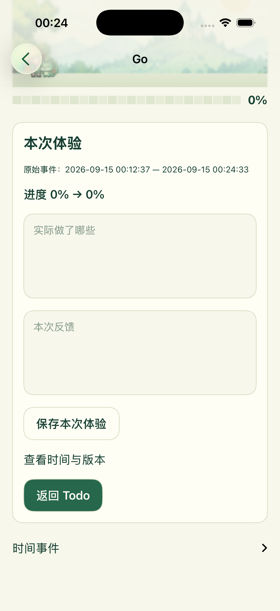

结束后展开体验区，显示原始事件时间、前后进度，并提供“实际做了哪些”“本次反馈”和返回 Todo。

操作与结果：
结束 Go → 可补充体验并保存，也可跳过体验返回。

边界／讨论点：
记录术语和大输入区域偏重；体验是本次记录，不应覆盖整个事情的历史。

W001 隔离模拟器真实截图；产品代码 4511d35。页面日期是测试时点，不是网站更新时间。

当前实现 · 0.1.18

### 成长报告 · 回看真实投入

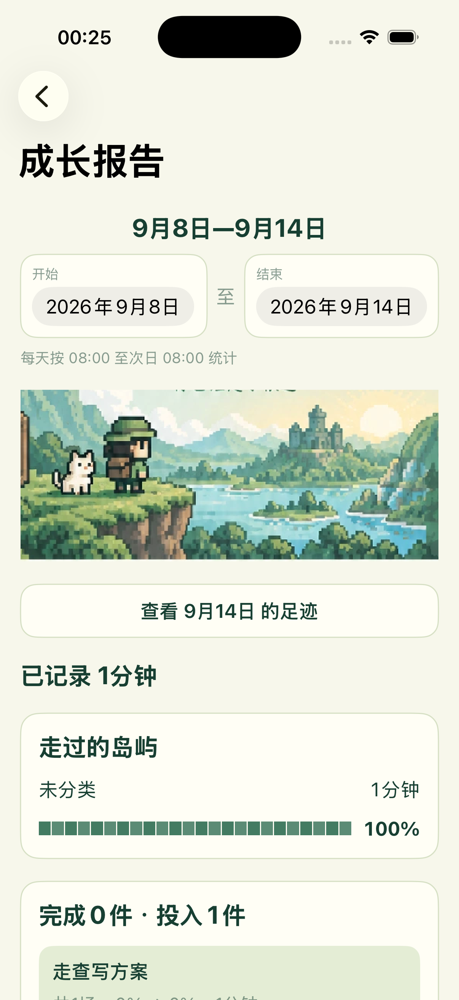

日期区间、像素场景、当日足迹入口、已记录时长、岛屿分布和事情汇总在同一页面。

操作与结果：
选择区间 → 看投入／完成汇总 → 下钻到某一天及具体记录。

边界／讨论点：
目前无每日趋势；按实际记录汇总，不以时长冒充价值。旧实现统计日为 08:00 至次日 08:00，不自动成为新版规则。

W001 隔离模拟器真实截图；产品代码 4511d35。页面日期是测试时点，不是网站更新时间。

当前实现 · 0.1.18

### 事情详情 · 名称、步骤与补充

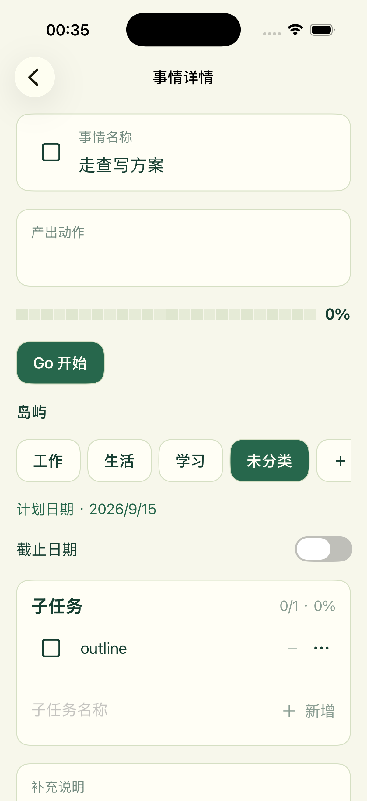

标题输入区内左侧完成框；下方产出动作、进度、Go、岛屿、计划／截止日期、子任务和补充说明。

操作与结果：
打开事情 → 修改名称／补充／日期 → 保存；子任务与 Go 引用同一事情。

边界／讨论点：
0.1.18 的保存还在表单下方，未保存直接返回会丢文字。右上保存＋退出气泡是独立候选，尚未合并安装。

W001 隔离模拟器真实截图；产品代码 4511d35。页面日期是测试时点，不是网站更新时间。

当前实现 · 0.1.18

### 足迹 · 事情发生过的证据

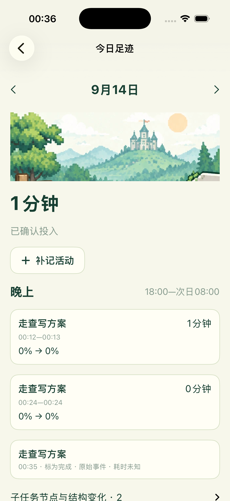

按日查看投入，提供补记活动入口，下方分时段显示 Go 片段、前后进度和完成事件。

操作与结果：
从报告进入某天 → 找到时段 → 查看详情；也可补记未用 Go 的实际活动。

边界／讨论点：
同一轮 Go 按运行分段展示，短片段可能显示 0 分钟；补记活动已有独立记录，不伪造任务。

W001 隔离模拟器真实截图；产品代码 4511d35。页面日期是测试时点，不是网站更新时间。

当前实现 · 0.1.18

### 再回来 · 未完成和已完成分开

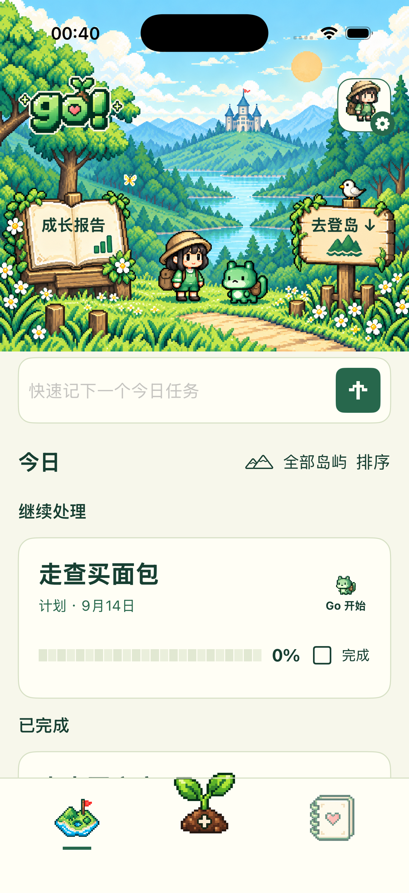

首页保留“继续处理”和“已完成”分组；未完成任务在前，已完成区在下面。

操作与结果：
做过一段 → 返回首页 → 继续未完事情，或回看已完成。

边界／讨论点：
一件事情的投入、完成与历史并非同一个概念；没有完成也可能已经推进。

W001 隔离模拟器真实截图；产品代码 4511d35。页面日期是测试时点，不是网站更新时间。

## 截图之外，产品还有哪些部分？

模块

现有能力

本次阅读边界

记／AI／历史

对话、草稿、整理提取、历史入口已有实现。

最新手机真实 AI 配置未复验；本网站不连接模型。历史应能找回整场对话及其产物是用户提出的改进诉求，不宣称现有入口已满足。

岛屿与担忧

岛屿归属、筛选、编辑及情绪／担忧关联已有阶段实现。

当前分类不是 3.0 的三种运转工作台；新版页面职责待定。

活动与时段详情

事后补记名称、起止时间，支持更正与查看旧版本；计入投入汇总。

补记不是伪造 Go；计划时间与实际时间分开。

我的／数据安全

归档恢复、完整文件导出导入、AI 配置与授权已有实现。

W001 没有重走所有次要路径；网站不提供实际导入、导出、授权或密钥输入。

系统计时展示

已有系统计时扩展，主 App 与扩展随当前包安装。

原生锁屏／灵动岛能力不是网页能力；历史图仅为设计参考。

## 已经提出的具体改进

输入与详情：
完成框放在标题输入区域前部；补充说明可正常输入；点输入区之外收键盘。这些是用户可用性诉求，不靠换色解决。

退出保护：
右上保存，保存后返回；修改后退出用轻量气泡【保存】【不存】，不叠加第二级确认。已有独立代码候选，未集成到 0.1.18。

长文字：
快速输入区域可拖到开头与末尾，保留原生编辑和完整发送。已有独立候选，未集成。

AI 历史：
用户希望按整场对话存档成事件，打开卡片看完整详情及产生的待办，不是折回当前对话页。AI 重设计暂缓，不把诉求当成已实现。

全局：
减少大卡片、重复字段与无效翻页，同时能组织很多事情；先梳理输入与行动，再设计有依据的回顾。

## 二、未来方向与备选方案

3.0 讨论快照 · 未实现

## 从生活分类，走向运转工作台。

已确认的是需要不同的运转体验，不是固定岛名、导航数量或数据库结构。先解决“记下—组织—选择—行动—接续”，回顾深化后置，必要历史留痕前置。

出发岛 · 暂用名

向外学习、获取、探索、交换和交付。希望有干劲、有希望，愿意出发；不只是创作岛。

消化岛

处理已带回的内容，安稳整理与沉淀。平静但仍在做事，不要求一次清空积压。

滋养岛

睡眠、泡澡、放松等不要求产出的恢复。不是另一张绩效清单，也不以时长评分。

### 三个维度，不是一棵强制分类树

岛屿是运转视角，项目是可跨岛的长期事项，时间是今天与未来的安排。每日主线独立保存，可关联岛、项目或事情，也可不绑定；同一件事不复制多份。

### 已确认、建议、待定分别是什么？

状态

内容

已确认方向

外脑承接、不同运转体验、项目与小事并存、每日一条主线、可见的时间与推进、保留经历。

建议，未定稿

先暂存后归位；快速新增与后续完善分开；事情内可选步骤；结束时留接续点。

待定

岛名与是否自定义、项目与事情转化、步骤层数、一件事的主岛与跨岛归属、进度表达、主线变更历史。

暂缓

AI 重设计、复杂回顾图表、飞行与昼夜扩展；不因此删除旧功能或数据。

不直接采用

稀疏极简首页、取消项目层、固定三 Tab、未经确认的混合进度公式。

后续讨论线索，尚未定稿：
事情可能先暂存，之后形成项目；同一项目可能包含出发、消化和滋养。暂存、项目和岛屿不一定是依次迁移的阶段。此点来自后续讨论摘要，不冒充已保存的 3.1 方案。

备选／历史探索 · 未实现

### 今日节奏 · 时间线

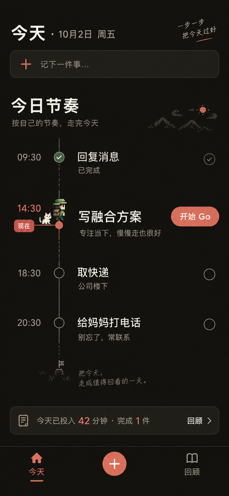

顶部快速记录；竖向时间线区分已完成、现在和稍后，当前条目提供 Go，底部显示投入与完成摘要。

操作与结果：
历史生图 → 对比信息结构 → 讨论取舍；尚未实现，不是 App 截图。

边界／讨论点：
想让一天的先后顺序更可感知。可讨论“时间线”，但不能把计划时间当实际投入。深色视觉、底栏和统计数字均非当前已选方案。

既有 GO 融合设计讨论中的生成原图，按原文件收录；画面文案与数字为示意，不作为真实使用记录。

备选／历史探索 · 未实现

### 接下来 · 简化清单

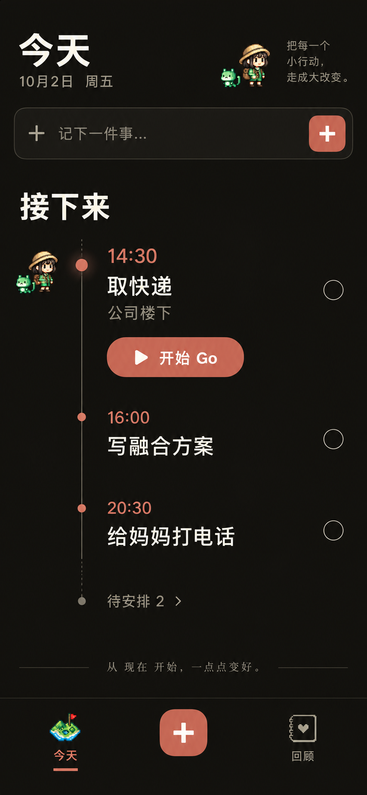

顶部“今天”与输入框，主区仅保留几条带时间的事情，当前事情突出 Go，另有待安排入口。

操作与结果：
历史生图 → 对比信息结构 → 讨论取舍；尚未实现，不是 App 截图。

边界／讨论点：
尝试降低开始成本。后续讨论不采用稀疏极简首页作为整体方向：需要能容纳大量事情和层级。此稿留作对比，不是待照搬的目标。

既有 GO 融合设计讨论中的生成原图，按原文件收录；画面文案与数字为示意，不作为真实使用记录。

备选／历史探索 · 未实现

### 此刻 · 单件聚焦

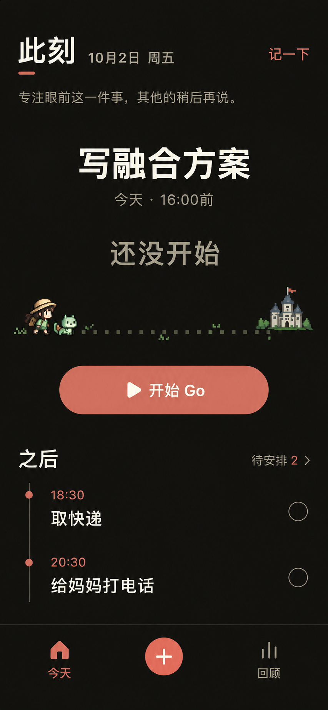

大标题突出当前一件事、截止提示、角色到城堡的路径和大 Go 按钮；下方压缩展示之后的事情。

操作与结果：
历史生图 → 对比信息结构 → 讨论取舍；尚未实现，不是 App 截图。

边界／讨论点：
尝试集中注意力。代价是一屏信息少；可作为局部专注状态参考，不能替代全局浏览、项目关系或大量储存。

既有 GO 融合设计讨论中的生成原图，按原文件收录；画面文案与数字为示意，不作为真实使用记录。

备选／历史探索 · 未实现

### 岛屿 · 紧凑工作台

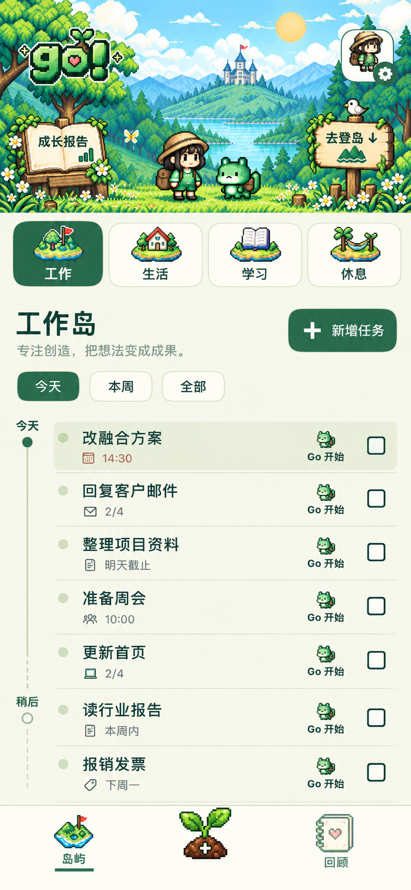

保留绿色像素场景，岛屿切换在上，工作岛列表采用较紧凑的行与今天／本周／全部过滤；每行可 Go 和完成。

操作与结果：
历史生图 → 对比信息结构 → 讨论取舍；尚未实现，不是 App 截图。

边界／讨论点：
尝试在保留趣味的同时提高信息密度。图中“工作／生活／学习／休息”是当时分类，不代表 3.0；3.0 讨论按运转方式组织。

既有 GO 融合设计讨论中的生成原图，按原文件收录；画面文案与数字为示意，不作为真实使用记录。

2.0 局部设计 · 历史备选

### 2.0 · 事情详情整体

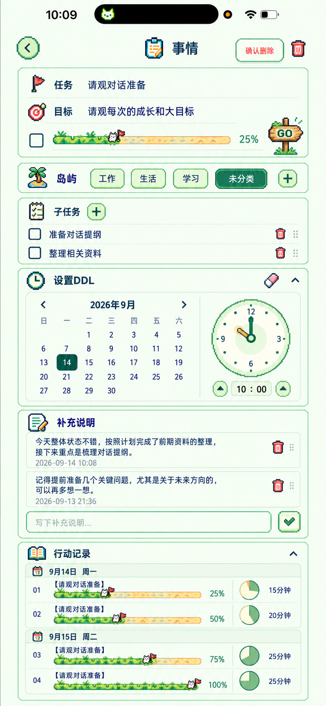

历史局部详情方案，整合事情、目标、进度、岛屿、步骤及 Go 记录。

操作与结果：
仅供对比局部结构；不是 0.1.18 的真实界面，也不是 3.0 完整定稿。

边界／讨论点：
旧 2.0 的自动／手动进度混合等规则不能直接套入新版。未保存退出的最新要求是轻量气泡【保存】【不存】，不增加二级确认弹窗。

旧事情详情开发包的“UI视觉参考_仅参考”；不收录来源可能含真实内容的用户截图拼贴。

2.0 局部设计 · 历史备选

### 2.0 · 事情详情空状态

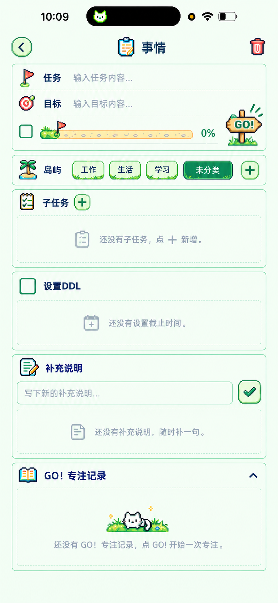

探索没有步骤与历史时的详情呈现。

操作与结果：
仅供对比局部结构；不是 0.1.18 的真实界面，也不是 3.0 完整定稿。

边界／讨论点：
旧 2.0 的自动／手动进度混合等规则不能直接套入新版。未保存退出的最新要求是轻量气泡【保存】【不存】，不增加二级确认弹窗。

旧事情详情开发包的“UI视觉参考_仅参考”；不收录来源可能含真实内容的用户截图拼贴。

2.0 局部设计 · 历史备选

### 2.0 · 截止日期展开

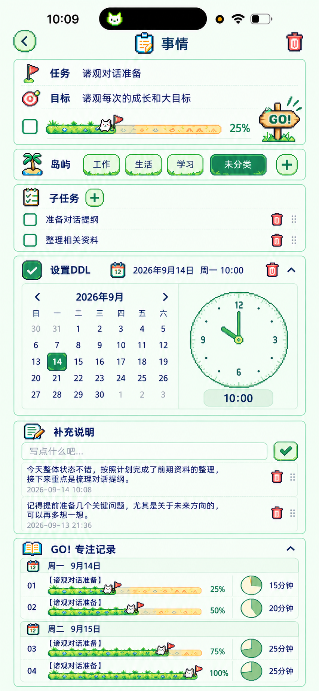

探索截止日期开关及日期时间选择。

操作与结果：
仅供对比局部结构；不是 0.1.18 的真实界面，也不是 3.0 完整定稿。

边界／讨论点：
旧 2.0 的自动／手动进度混合等规则不能直接套入新版。未保存退出的最新要求是轻量气泡【保存】【不存】，不增加二级确认弹窗。

旧事情详情开发包的“UI视觉参考_仅参考”；不收录来源可能含真实内容的用户截图拼贴。

2.0 局部设计 · 历史备选

### 2.0 · 删除确认探索

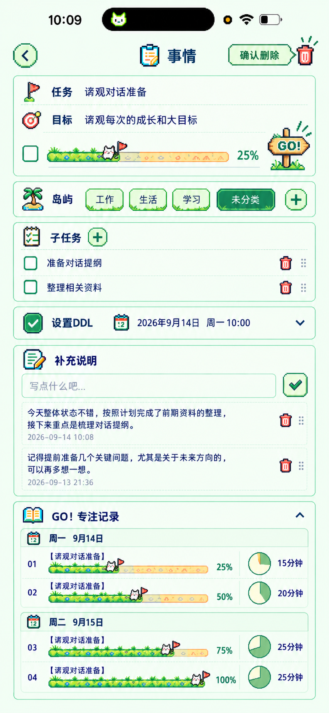

历史删除确认交互参考，与“退出是否保存”的气泡不是一回事。

操作与结果：
仅供对比局部结构；不是 0.1.18 的真实界面，也不是 3.0 完整定稿。

边界／讨论点：
旧 2.0 的自动／手动进度混合等规则不能直接套入新版。未保存退出的最新要求是轻量气泡【保存】【不存】，不增加二级确认弹窗。

旧事情详情开发包的“UI视觉参考_仅参考”；不收录来源可能含真实内容的用户截图拼贴。

2.0 局部设计 · 历史备选

### 2.0 · 补充说明与记录

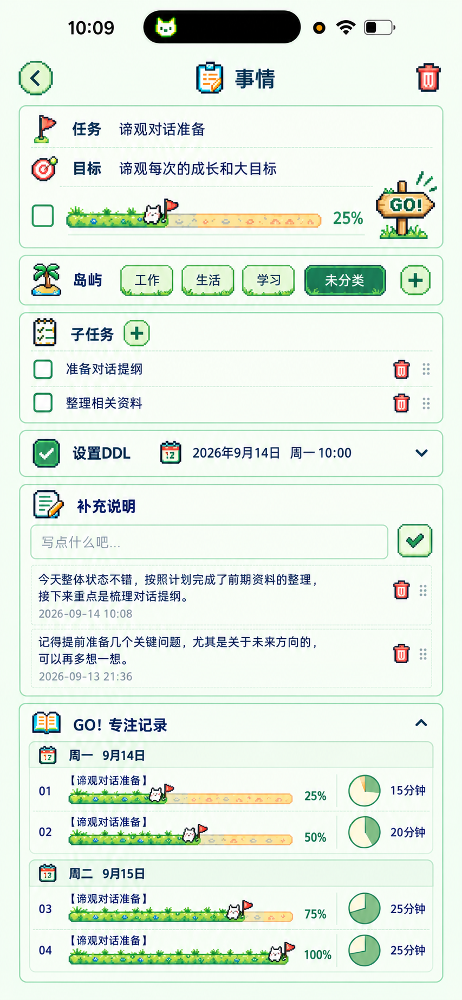

探索补充说明与行动记录如何在详情里呈现。

操作与结果：
仅供对比局部结构；不是 0.1.18 的真实界面，也不是 3.0 完整定稿。

边界／讨论点：
旧 2.0 的自动／手动进度混合等规则不能直接套入新版。未保存退出的最新要求是轻量气泡【保存】【不存】，不增加二级确认弹窗。

旧事情详情开发包的“UI视觉参考_仅参考”；不收录来源可能含真实内容的用户截图拼贴。

## IP 角色与品牌

IP 是 go! 的陪伴感和状态表达，不只是装饰。既有视觉由戴帽背包的小女孩与绿色小猫组成。

既有设计素材 · 不等于全部动画已接入

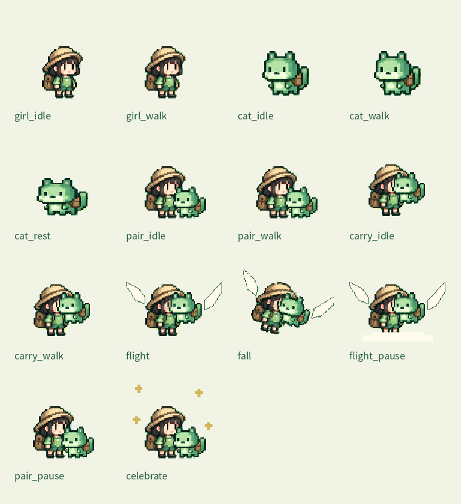

原开发包 IP 状态总览。

### 状态怎样服务体验？

女孩／小猫／双人待机：稳定身份与陪伴，不代表正在计时。

女孩／猫／双人行走：行动过程的轻量反馈。

小猫休息、双人暂停：停下来也有合适表达，不用失败惩罚用户。

背负待机与行走：角色组合变化，业务触发仍需规则决定。

飞行、下落、飞行暂停：历史专注模式视觉，不是网页已实现能力。

庆祝：正向反馈，不能用动画伪造完成或进度。

素材说明指出：这些状态使用裁切、组合、轻微位移与旋转，行走并非精细肢体逐帧重绘。减少动态效果时应保留静态表达。

### 更新过的 IP 找到了吗？

找回了既有 14 状态角色总览与后续品牌 Logo 生图；尚未核实另一套已确认替换女孩／小猫的新版角色原图。
不把旧素材称为最新版本，不重新生成冒充历史更新。Logo 更新不等于角色更新。

历史品牌探索 · 不代表已上线

找回的品牌字标探索，不是新版角色。

### 值得讨论

角色是固定陪伴者还是用户化身？哪些状态承担业务含义？空状态如何邀请开始而不催促？这些问题尚未定稿。

## 缺省、空状态与异常反馈

已有设计，但不是全产品完整缺省系统。“没有内容”与“操作失败”分开呈现，全部直接展开。共 4 个部分、4 张截图：① 首页空内容 1 张；② 事情详情空内容 1 张；③ AI 整理失败 1 张；④ 备份失败 1 张。

### 首页没有内容

历史设计

双人角色、“还没有线索”、去记和新增事情入口。避免空白，但不强迫使用 AI。

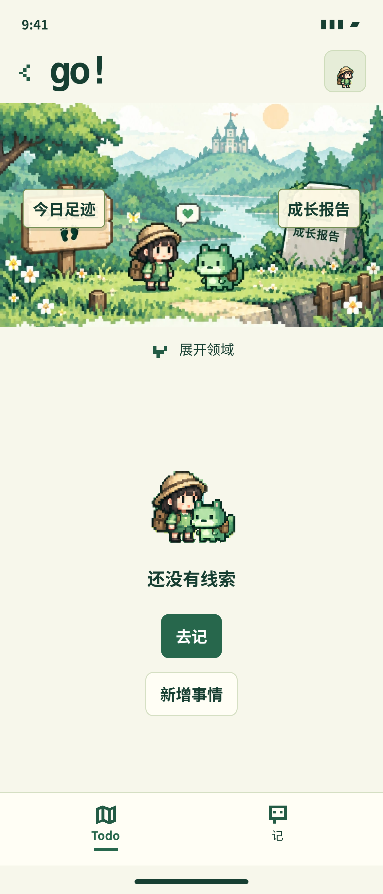

### 详情没有步骤或记录

2.0 历史备选

已有局部空状态参考；没有步骤与行动记录时仍可理解事情并开始，不先补满表单。

### AI 整理失败

历史异常设计

提示整理未完成、原话已保留，并可重试。失败不应让输入消失，也不等于空数据。

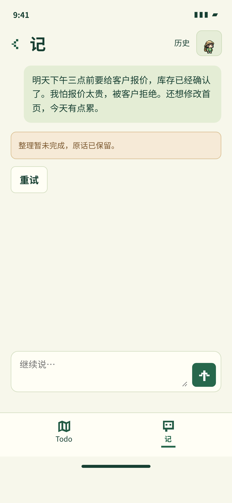

### 备份失败

历史异常设计

上次成功备份继续可见，本次失败明确提示与重试，不把失败表现成没有历史。

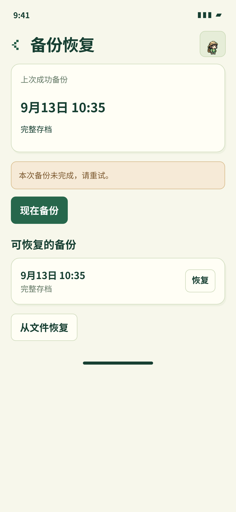

### 尚未找到独立定稿

筛选无结果、首次使用引导、加载中、离线、权限拒绝、无报告数据等，没有足够材料确认各自已有专门定稿。保留缺口，不用通用空状态图冒充全覆盖。

## 三、旧版 31 张页面与状态参考

以下每项都属于历史设计。描述的是旧设计意图，不是当前能力保证，不作为新版必须继承的规则。

1.0 历史设计 · 非现状

### P01 · 启动

直接进入世界，不增加每日启动任务。 页面内容：go! 品牌；小女孩与小猫的山野场景。

操作与结果：
准备好本地数据后进入首页；演示可点击进入。

边界／讨论点：
以下是旧版设计规则，不是新版确认，也不证明全部实现：启动不生成事项或开始计时；不强制登录。

原开发包 pages.json 与 31 张页面／状态设计图。release 字段不作为实际发布证明。

1.0 历史设计 · 非现状

### P02 · Todo 首页

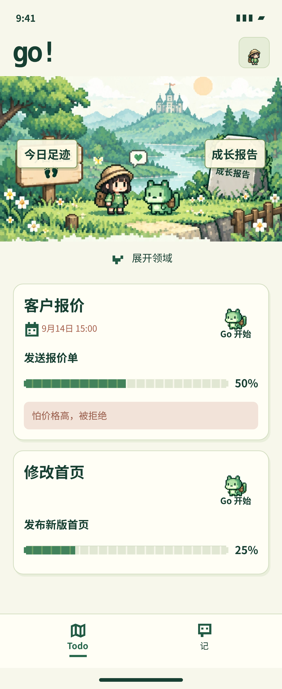

只展开眼前值得关注的事情。 页面内容：铺满顶部的场景背景，上叠像素go!与女孩设置入口；场景内成长报告翻开书与去登岛木牌；小女孩和小猫同场；去登岛：木牌与空白下拉入口；今日标题旁有全部岛屿筛选；少量关注线索：名称、期限、产出动作、关联担忧、子任务比例、小猫 Go。

操作与结果：
点场景物体进入对应报告。；点去登岛或在任务层空白处下拉进入岛屿选择；收起或再次点Todo回任务视图。；卡片正文进入详情，小猫 Go 开始同一事项的会话。

边界／讨论点：
以下是旧版设计规则，不是新版确认，也不证明全部实现：首页关注仅决定展示，不等于优先级；排序建议用规则提供理由，允许用户覆盖。；进度只读且同源，完成框在进度条与百分比右侧同一行。所有未完成在前，最近完成的置完成组首；筛选不破坏手动排序。

原开发包 pages.json 与 31 张页面／状态设计图。release 字段不作为实际发布证明。

1.0 历史设计 · 非现状

### P03 · 全部岛屿

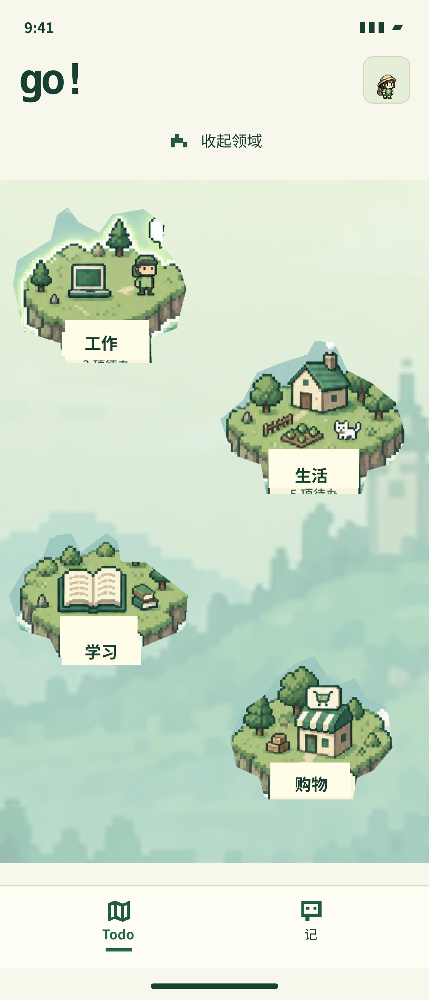

完整事情有归属，首页不堆满。 页面内容：同一世界底图展开的岛屿岛屿；岛屿名称与专属图标；收起岛屿像素手柄。

操作与结果：
点击岛进入岛屿。；向上拉手柄、点收起或点 Todo 回首页默认态。

边界／讨论点：
以下是旧版设计规则，不是新版确认，也不证明全部实现：属于首页展开状态，不是第三Tab；木牌可点，任务层空白可下拉，不抢输入/卡片/按钮或普通列表滚动。；有依据才建议分类；未归类可容纳不明内容。

原开发包 pages.json 与 31 张页面／状态设计图。release 字段不作为实际发布证明。

1.0 历史设计 · 非现状

### P04 · 岛屿·事情

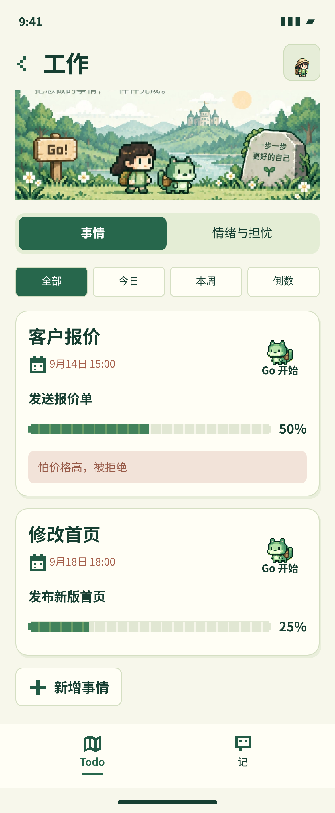

在某个岛屿按期限找要做的事。 页面内容：岛屿名与小女孩、小猫场景；事情／情绪与担忧切换；全部／今日／本周／倒数筛选；事情卡、像素进度、新增事情。

操作与结果：
点倒数原地展开第N天选择，不另开多层弹窗。；点卡片进详情；点小猫 Go；新增事情原位或编辑页。

边界／讨论点：
以下是旧版设计规则，不是新版确认，也不证明全部实现：期限筛选按本地日历日；默认不把倒数偷换成N天内。；无期限只在全部；周期事项按本次实例到期日。

原开发包 pages.json 与 31 张页面／状态设计图。release 字段不作为实际发布证明。

1.0 历史设计 · 非现状

### P05 · 岛屿·情绪

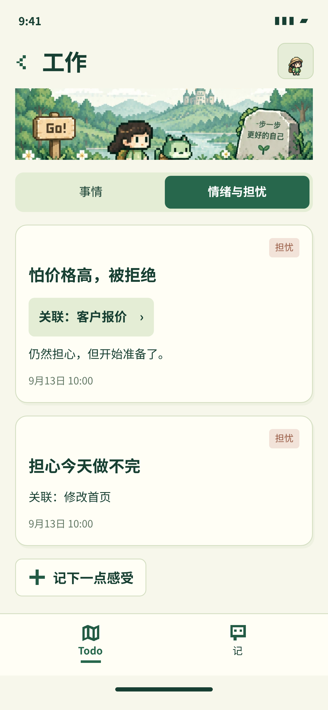

分开看担忧，又能回到事情。 页面内容：岛屿名与类型切换；担忧卡标题、右上小标签、关联事情、最近变化、日期；记下一点感受。

操作与结果：
点标题看详情；点关联直接去事情。；新增感受原地输入并保存。

边界／讨论点：
以下是旧版设计规则，不是新版确认，也不证明全部实现：情绪不是待办，不显示完成框、DDL筛选或进度。；担忧是否真的阻碍行动须有用户证据，不能仅凭情绪推定。

原开发包 pages.json 与 31 张页面／状态设计图。release 字段不作为实际发布证明。

1.0 历史设计 · 非现状

### P06 · 事情详情

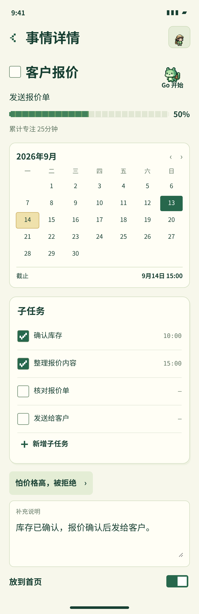

明确一件事的结束动作、依赖与进展。 页面内容：标题与产出动作可直接编辑，整件完成框在标题左侧；整卡点击可输入；小猫 Go、只读像素进度、累计专注；标记今天和截止时间的小日历；子任务、关联担忧、补充说明、放到首页。

操作与结果：
点文字直接输入，提交更新同一个 ID。；点日历原地选择日期时间；点担忧跳转。；勾选子任务触发完成事件；整件框行为见决策门 D03。

边界／讨论点：
以下是旧版设计规则，不是新版确认，也不证明全部实现：不展示重复事情/工作标签；所有页面共用任务。；有子任务时只由 C/N 判断完成；不存在强制设置100%的接口。

原开发包 pages.json 与 31 张页面／状态设计图。release 字段不作为实际发布证明。

1.0 历史设计 · 非现状

### P07 · 担忧详情

把心理变化作为独立轨迹留下。 页面内容：山野场景；标题旁小类型标签；我的原话、关联事情；含日期时间的变化足迹、记下变化输入。

操作与结果：
点关联事情进入详情。；输入新变化追加时间轴；内容可原地修正。

边界／讨论点：
以下是旧版设计规则，不是新版确认，也不证明全部实现：同一担忧可多对多关联事情；不能自动评分或解决。；归档保留原话、关联与历史。

原开发包 pages.json 与 31 张页面／状态设计图。release 字段不作为实际发布证明。

1.0 历史设计 · 非现状

### P08 · 新增编辑事情

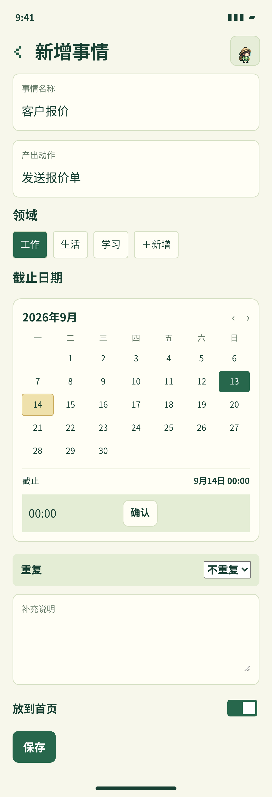

名称即可保存，其他资料不成为录入门槛。 页面内容：名称、产出动作输入框；已有岛屿按钮与新增岛屿；日历和原地时间组件，重复可选；补充输入、放到首页开关、保存。

操作与结果：
选日期后原地展开时间，默认00:00，可调整并确认。；点保存创建或更新；输入中支持草稿。

边界／讨论点：
以下是旧版设计规则，不是新版确认，也不证明全部实现：00:00指所选日开始；没有日期不编造期限。；没有子任务不强行替用户细拆；无子任务完成策略见D01。

原开发包 pages.json 与 31 张页面／状态设计图。release 字段不作为实际发布证明。

1.0 历史设计 · 非现状

### P09 · 岛屿编辑

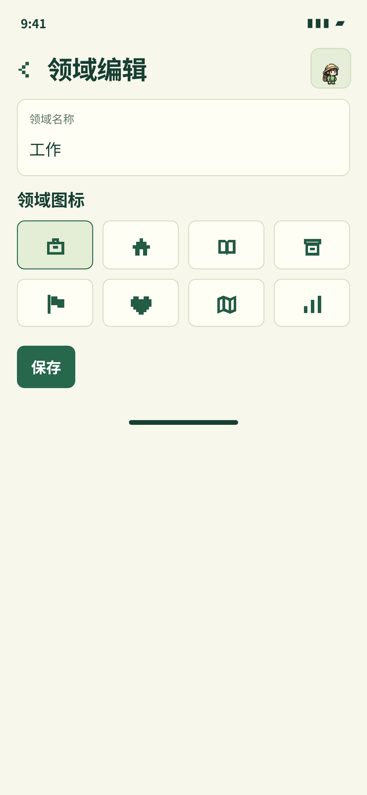

编辑分类不搬丢事情。 页面内容：岛屿名称；像素图标选择；保存。

操作与结果：
从岛屿标题旁入口进入；点图标选中；保存返回。

边界／讨论点：
以下是旧版设计规则，不是新版确认，也不证明全部实现：按稳定domainID关联；移除岛屿不级联删除事项。

原开发包 pages.json 与 31 张页面／状态设计图。release 字段不作为实际发布证明。

1.0 历史设计 · 非现状

### P10 · 记·对话

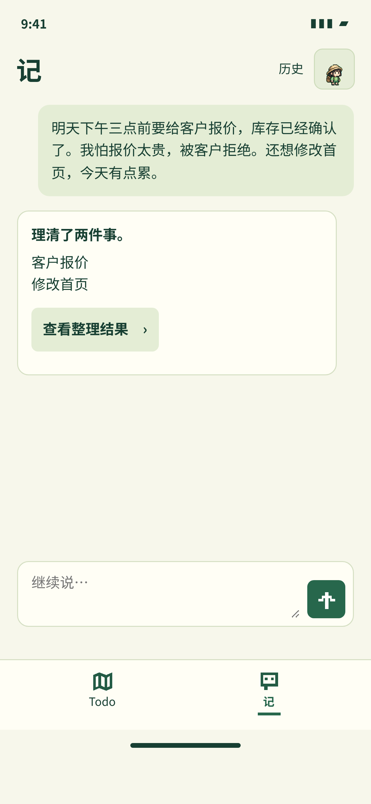

不先整理就能输入，原文立即有落点。 页面内容：标题、历史、我的；简短对话；底部输入框。

操作与结果：
首次进入此Tab聚焦；主动收起后普通Tab往返或历史返回不强制聚焦，显式新对话可聚焦。；发送先本地落盘，再按授权请求整理；继续反馈接原对话。

边界／讨论点：
以下是旧版设计规则，不是新版确认，也不证明全部实现：不自建录音或键盘；不保存音频。；失败仍保留原文；重试不能重复生成任务；输入法未提交组词不能被丢弃。

原开发包 pages.json 与 31 张页面／状态设计图。release 字段不作为实际发布证明。

1.0 历史设计 · 非现状

### P11 · 整理结果

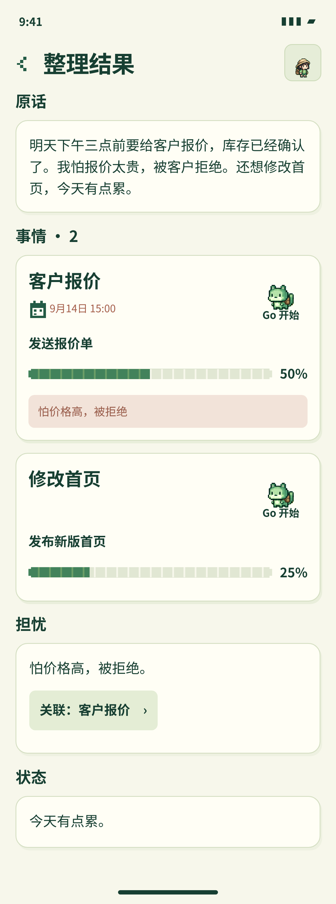

清楚呈现原话、事情、担忧与状态。 页面内容：原话在最前；同构事情卡片；担忧及关联；状态。

操作与结果：
点内容直接改；已明确事务自动入Todo；小猫可Go。

边界／讨论点：
以下是旧版设计规则，不是新版确认，也不证明全部实现：原文、AI建议、用户修改分别留证；重试不覆盖用户改过的字段。；AI不能直接改进度/伪造完成/擅定期限；未确定信息保留待定。

原开发包 pages.json 与 31 张页面／状态设计图。release 字段不作为实际发布证明。

1.0 历史设计 · 非现状

### P12 · 历史记录

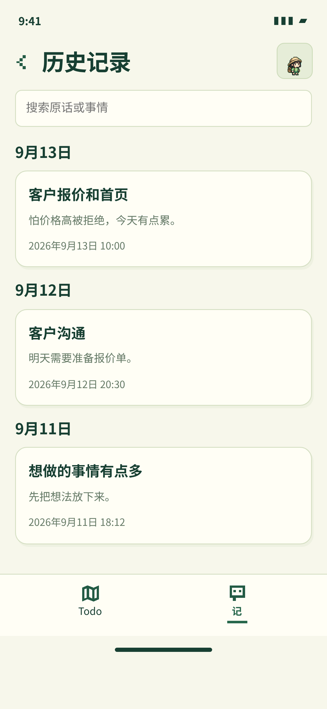

接上原来的思路。 页面内容：全屏横向进入，不露底层聊天；顶部搜索，事情/消息分类，各自全部/今日/单日/日期段条件；默认消息；已发送即自动保存，无需主动存档。

操作与结果：
事情/消息分别搜索；事情复用详情共享进度，消息进入只读记录定位命中处；返回不切换当前聊天或丢草稿。

边界／讨论点：
以下是旧版设计规则，不是新版确认，也不证明全部实现：事情仅含实际AI生成并保存的任务，消息仅查已发送正文；不建立事情与具体对话来源绑定，取消主动存档/修改历史UI。归档沿用原入口。

原开发包 pages.json 与 31 张页面／状态设计图。release 字段不作为实际发布证明。

1.0 历史设计 · 非现状

### P13 · Go 专注

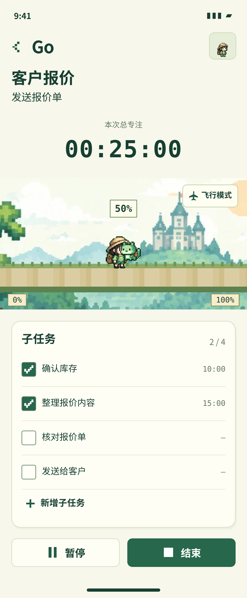

用一条道路呈现真实任务进度与当前投入。 页面内容：可编辑事情名与产出动作；本次总专注数字；道路就是只读进度，小女孩与小猫站在C/N位置；图内右上飞行入口；子任务耗时、原地新增、暂停／结束。

操作与结果：
打勾→单一完成事件→分段结算→比例重算→角色前进。；暂停冻结计时/走路；继续恢复；结束先保存再原页展开体验。；改名不改ID，不重启会话；切飞行共用sessionID。

边界／讨论点：
以下是旧版设计规则，不是新版确认，也不证明全部实现：暂停扣除；分段依据实际打勾顺序而非列表顺序。；路面循环不增长百分比；不能拖路或角色改进度。；结束不完成子任务。

原开发包 pages.json 与 31 张页面／状态设计图。release 字段不作为实际发布证明。

1.0 历史设计 · 非现状

### P14 · 飞行模式

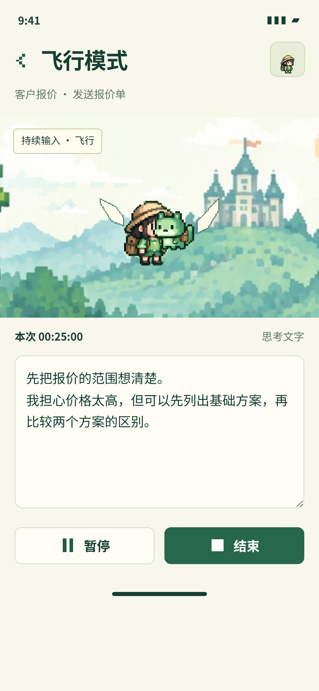

通过持续表达支持思考。 页面内容：任务及产出动作；女孩抱猫飞行场景；输入框、本次有效时长；暂停／结束。

操作与结果：
新增或修改文本更新输入活动；停输后下坠；恢复输入起飞。；主动暂停冻结；结束进入同一体验面板；文本存当前事情。

边界／讨论点：
以下是旧版设计规则，不是新版确认，也不证明全部实现：文字量与任务进度无关；不识别真实语音，不承诺输入法逐字回传。；宽限/下坠参数是可调演示值，待输入法真机测试D06。；不因下坠销毁文字或归档事情。

原开发包 pages.json 与 31 张页面／状态设计图。release 字段不作为实际发布证明。

1.0 历史设计 · 非现状

### P15 · 本次体验

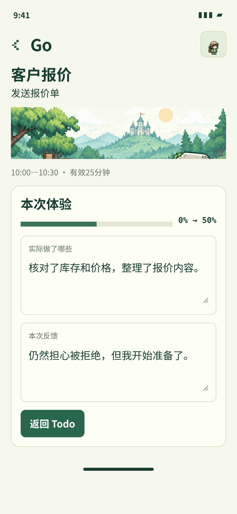

结束后留下实际行动和感受，填不填都留住时间。 页面内容：仍在Go原页面；只读起止、耗时、进度差；实际做了哪些、本次反馈；返回Todo。

操作与结果：
结束先关闭运行区间并持久化；面板原位展开。；输入自动保存，允许跳过；收起不重新启动。

边界／讨论点：
以下是旧版设计规则，不是新版确认，也不证明全部实现：进度来自子任务事件，不能手填；反馈不自动确认完成。

原开发包 pages.json 与 31 张页面／状态设计图。release 字段不作为实际发布证明。

1.0 历史设计 · 非现状

### P16 · 今日足迹

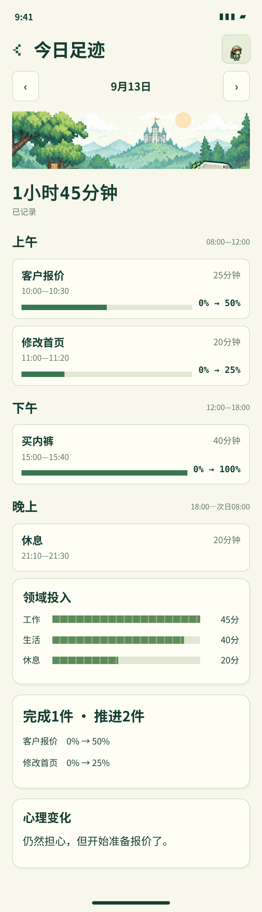

看见实际度过的时段及岛屿投入。 页面内容：日期导航与场景；上午08–12、下午12–18、晚上18–次日08；每段标题、起止、有效时长、事件进度差；岛屿分钟图、完成/推进、心理变化。

操作与结果：
切日期；点时段看详情，点事项回任务。

边界／讨论点：
以下是旧版设计规则，不是新版确认，也不证明全部实现：足迹日与DDL日边界不同；跨界切片不复制会话。；未记录留未知，子任务时长不在总量上二次相加。；休息等活动可无完成百分比；报告不制造效率分。

原开发包 pages.json 与 31 张页面／状态设计图。release 字段不作为实际发布证明。

1.0 历史设计 · 非现状

### P17 · 时段详情

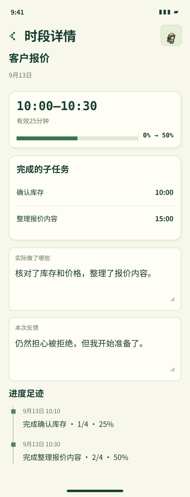

一条Go记录能回溯、能修正。 页面内容：标题、日期、起止和有效时长；本次子任务耗时与只读进度差；实际行动、反馈；带时间的完成事件。

操作与结果：
点实际文本/起止时间直接编辑；校验交叠。

边界／讨论点：
以下是旧版设计规则，不是新版确认，也不证明全部实现：进度只从事件派生；更正留版本，不改写原证据。；不能把过去间隔推成独占子任务耗时。

原开发包 pages.json 与 31 张页面／状态设计图。release 字段不作为实际发布证明。

1.0 历史设计 · 非现状

### P18 · 成长报告

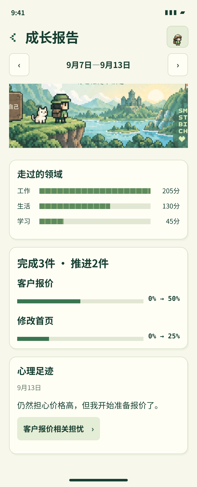

回看一段时间做过的事与感受变化。 页面内容：日期范围与山野场景；各岛屿投入；完成事项与未完成但推进事项逐件明细；心理足迹。

操作与结果：
切范围，下钻事项、时段与担忧。

边界／讨论点：
以下是旧版设计规则，不是新版确认，也不证明全部实现：不平均或相加不同任务百分比成效率；件数按任务/周期实例去重。；结构变化不包装为推进；心理变化来自用户文本。

原开发包 pages.json 与 31 张页面／状态设计图。release 字段不作为实际发布证明。

1.0 历史设计 · 非现状

### P19 · 我的

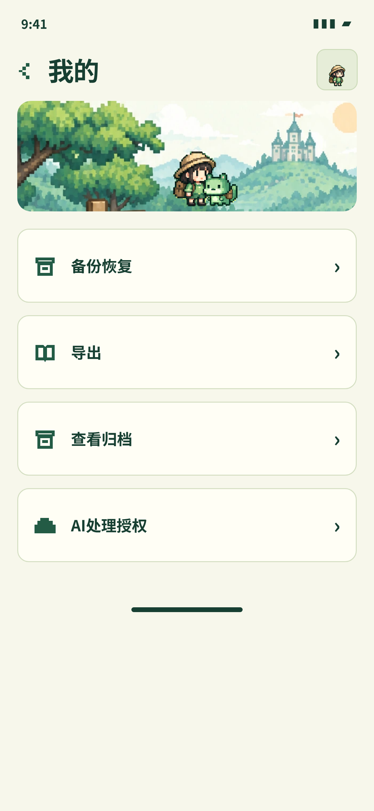

只管理必要数据。 页面内容：备份恢复；导出；查看归档；AI处理授权。

操作与结果：
仅Todo/记一级页右上女孩加齿轮入口进入；二级页不摆我的，返回原位置，不循环叠加。

边界／讨论点：
以下是旧版设计规则，不是新版确认，也不证明全部实现：不是第三Tab；访问设置不等于结束专注。

原开发包 pages.json 与 31 张页面／状态设计图。release 字段不作为实际发布证明。

1.0 历史设计 · 非现状

### P20 · 备份恢复

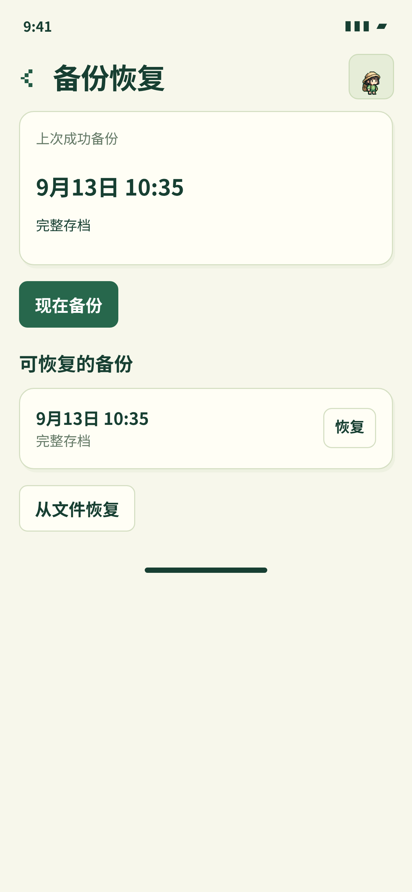

换机后信息、关联与历史一起回来。 页面内容：最近成功备份；备份列表、现在备份；从文件恢复；处理/失败状态。

操作与结果：
导出版本化完整文件；恢复先校验/预览，再事务提交；保留恢复前快照。

边界／讨论点：
以下是旧版设计规则，不是新版确认，也不证明全部实现：同步不代替备份；重复导入按稳定ID幂等；未经成功不显示已备份。；跨设备活跃会话冲突需处理，不能双计。

原开发包 pages.json 与 31 张页面／状态设计图。release 字段不作为实际发布证明。

1.0 历史设计 · 非现状

### P21 · 导出

数据既可阅读也可迁移。 页面内容：可读文本；完整存档；导出。

操作与结果：
选择格式，使用系统文件/分享功能；失败重试。

边界／讨论点：
以下是旧版设计规则，不是新版确认，也不证明全部实现：完整文件带schemaVersion、ID、关系、事件、校验；不包含API密钥。

原开发包 pages.json 与 31 张页面／状态设计图。release 字段不作为实际发布证明。

1.0 历史设计 · 非现状

### P22 · 查看归档

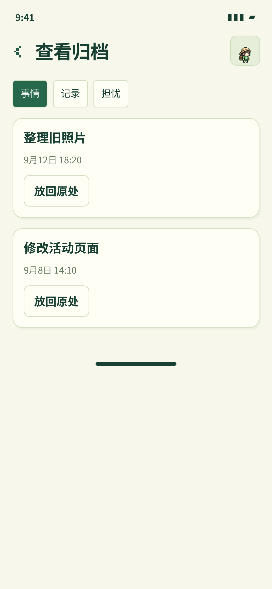

误移除仍可找回。 页面内容：事情／记录／担忧；归档日期；放回原处。

操作与结果：
恢复原ID及关联；已有时不复制。

边界／讨论点：
以下是旧版设计规则，不是新版确认，也不证明全部实现：归档不删除已经发生的时间；子任务归档改分母须标结构事件。

原开发包 pages.json 与 31 张页面／状态设计图。release 字段不作为实际发布证明。

1.0 历史设计 · 非现状

### P23 · AI处理授权

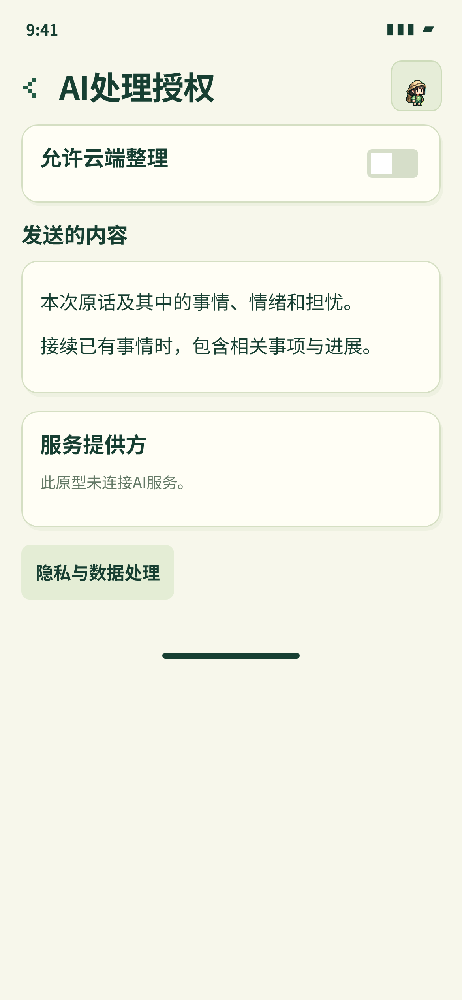

只发送获得授权的内容。 页面内容：真实提供方与发送内容；授权开关；隐私及数据处理说明入口。

操作与结果：
开启前明示混合文本上传范围；关闭后不发新请求。

边界／讨论点：
以下是旧版设计规则，不是新版确认，也不证明全部实现：不能勾除情绪却上传仍含情绪的整段原文；不宣称未经验证的端侧/加密。；密钥在服务端，本地功能不依赖AI。

原开发包 pages.json 与 31 张页面／状态设计图。release 字段不作为实际发布证明。

1.0 历史设计 · 非现状

### P24 · 灵动岛与锁屏

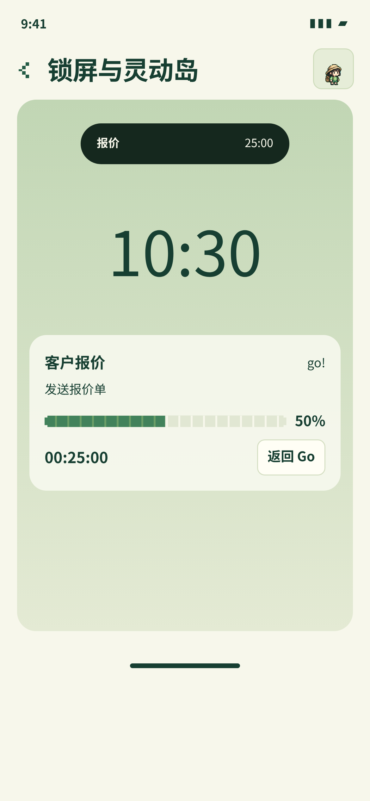

离开App后仍看见当前任务和有效时长。 页面内容：动态岛两字简称和计时；锁屏事项、只读进度；暂停态。

操作与结果：
点活动返回当前Go；暂停操作同一会话。

边界／讨论点：
以下是旧版设计规则，不是新版确认，也不证明全部实现：为后续阶段；展示终止不结束会话，系统能力按真机验证。；不是后台保活办法，不在岛上持续播放游戏。

原开发包 pages.json 与 31 张页面／状态设计图。release 字段不作为实际发布证明。

1.0 历史设计 · 非现状

### S01 · Go 已暂停

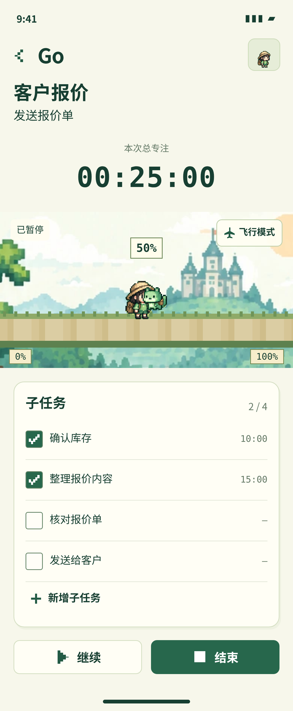

计时与动效冻结，完成数据仍可查看。 页面内容：计时与动效冻结，完成数据仍可查看。。

操作与结果：
操作沿用所属页面；可恢复返回。

边界／讨论点：
以下是旧版设计规则，不是新版确认，也不证明全部实现：暂停扣除；分段依据实际打勾顺序而非列表顺序。；路面循环不增长百分比；不能拖路或角色改进度。；结束不完成子任务。

原开发包 pages.json 与 31 张页面／状态设计图。release 字段不作为实际发布证明。

1.0 历史设计 · 非现状

### S02 · 飞行下坠

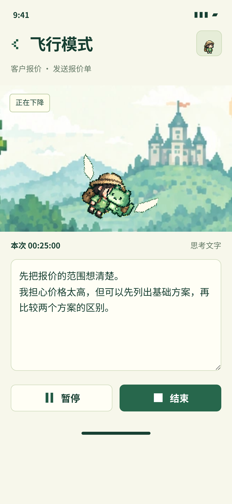

短暂停输有可恢复反馈，文本完整保留。 页面内容：短暂停输有可恢复反馈，文本完整保留。。

操作与结果：
操作沿用所属页面；可恢复返回。

边界／讨论点：
以下是旧版设计规则，不是新版确认，也不证明全部实现：文字量与任务进度无关；不识别真实语音，不承诺输入法逐字回传。；宽限/下坠参数是可调演示值，待输入法真机测试D06。；不因下坠销毁文字或归档事情。

原开发包 pages.json 与 31 张页面／状态设计图。release 字段不作为实际发布证明。

1.0 历史设计 · 非现状

### S03 · 飞行已暂停

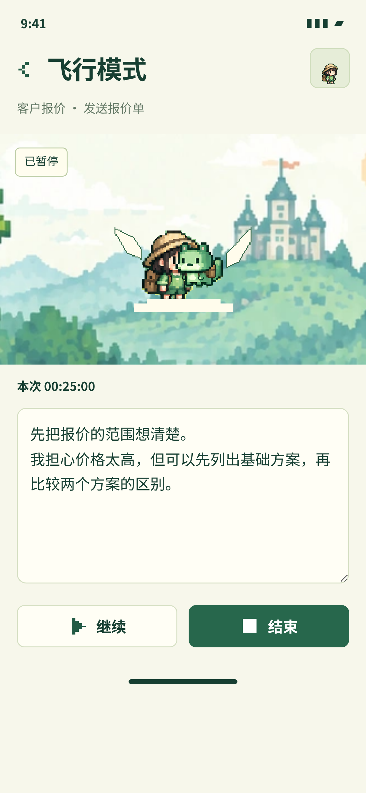

主动暂停不惩罚，继续后重新给予输入缓冲。 页面内容：主动暂停不惩罚，继续后重新给予输入缓冲。。

操作与结果：
操作沿用所属页面；可恢复返回。

边界／讨论点：
以下是旧版设计规则，不是新版确认，也不证明全部实现：文字量与任务进度无关；不识别真实语音，不承诺输入法逐字回传。；宽限/下坠参数是可调演示值，待输入法真机测试D06。；不因下坠销毁文字或归档事情。

原开发包 pages.json 与 31 张页面／状态设计图。release 字段不作为实际发布证明。

1.0 历史设计 · 非现状

### S04 · 首页空态

没有任务时可去记或直接新增。 页面内容：没有任务时可去记或直接新增。。

操作与结果：
操作沿用所属页面；可恢复返回。

边界／讨论点：
以下是旧版设计规则，不是新版确认，也不证明全部实现：首页关注仅决定展示，不等于优先级；排序建议用规则提供理由，允许用户覆盖。；进度只读且与所有页面同源；首页不重复摆成长报告。

原开发包 pages.json 与 31 张页面／状态设计图。release 字段不作为实际发布证明。

1.0 历史设计 · 非现状

### S05 · 整理失败

原文已保留，提供重试，不让用户重说。 页面内容：原文已保留，提供重试，不让用户重说。。

操作与结果：
操作沿用所属页面；可恢复返回。

边界／讨论点：
以下是旧版设计规则，不是新版确认，也不证明全部实现：不自建录音或键盘；不保存音频。；失败仍保留原文；重试不能重复生成任务；输入法未提交组词不能被丢弃。

原开发包 pages.json 与 31 张页面／状态设计图。release 字段不作为实际发布证明。

1.0 历史设计 · 非现状

### S06 · 备份失败

如实显示失败，保留上次成功时间。 页面内容：如实显示失败，保留上次成功时间。。

操作与结果：
操作沿用所属页面；可恢复返回。

边界／讨论点：
以下是旧版设计规则，不是新版确认，也不证明全部实现：同步不代替备份；重复导入按稳定ID幂等；未经成功不显示已备份。；跨设备活跃会话冲突需处理，不能双计。

原开发包 pages.json 与 31 张页面／状态设计图。release 字段不作为实际发布证明。

1.0 历史设计 · 非现状

### S07 · 倒数筛选展开

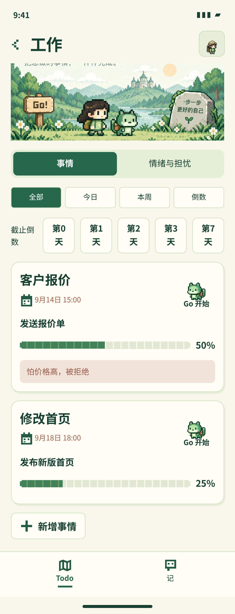

在原地选择第N天，不换一套页面。 页面内容：在原地选择第N天，不换一套页面。。

操作与结果：
操作沿用所属页面；可恢复返回。

边界／讨论点：
以下是旧版设计规则，不是新版确认，也不证明全部实现：期限筛选按本地日历日；默认不把倒数偷换成N天内。；无期限只在全部；周期事项按本次实例到期日。

原开发包 pages.json 与 31 张页面／状态设计图。release 字段不作为实际发布证明。

## 来源与覆盖边界

现状：CURRENT_STATE、CURRENT_UI 与 W001；8 张真实合成数据截图，代码基线 4511d35。

需求：2026-10-02 REQUIREMENTS 1.0，保留 RQ01—RQ13 的核心含义，不公开私人背景原话。

方向：product-versions/3.0/PRODUCT；仍是讨论快照，非完整交互规格。

历史：pages.json 对应 31 张原设计；2.0 事情详情 5 张局部参考；另找回 4 张 GO 融合讨论生图。

未合并候选：1ab669f（保存气泡）、17a55c6（长输入滚动）。网站不执行合并、不更新手机。

本次未收录：用户真实截图拼贴、真实数据库、API Key、设备标识、私人聊天原文、与 GO 无关的生成图。未找到新版三种工作台的已定稿页面原图，使用文字说明，不伪造。

所有“当前”是有日期的公开快照，不会自动追踪未来 App 修改。网页交互仅为局部示意，不是 App 验收证据。

本网站免登录且核心内容无需脚本。能否识别图片仍取决于读取方能力；文字说明不等于声称已看到图片。

## 讨论提示词

请阅读这个网站的完整阅读版，严格区分当前实现、未合并候选、历史设计和未实现备选。先用自己的话复述 go! 要解决的问题，再从“记录→组织→选择主线→行动→接续”提出最值得讨论的三项优化；每项说明用户会怎么用、收益和代价，不要直接写代码。读不到图片或页面时请明确说明。

## ChatGPT 需要点击吗？

理解产品不需要点击。
完整阅读版直接展开布局、职责、操作结果、IP 与缺省。顶部导航只定位本页章节，不打开二级页面。

网站是阅览资料，不是完整可操作 App。本页不再提供输入模拟，全部以静态图文展示；不连接 AI、不计时、不保存到手机。截图中的按钮不是可点击控件。

能否点击输入取决于 ChatGPT 当前会话的浏览器操作工具、站点权限与访问条件。仅能读取文字的模式不能保证交互。本页不依赖任何浏览器操作能力。

请优先阅读完整页或 GitHub 的 READING.md，不要求逐个访问所有子页；图片读不到时依据文字描述，不假装看过。

go! 产品阅览室 · 所有内容已在本页展开 · 公开去敏快照

